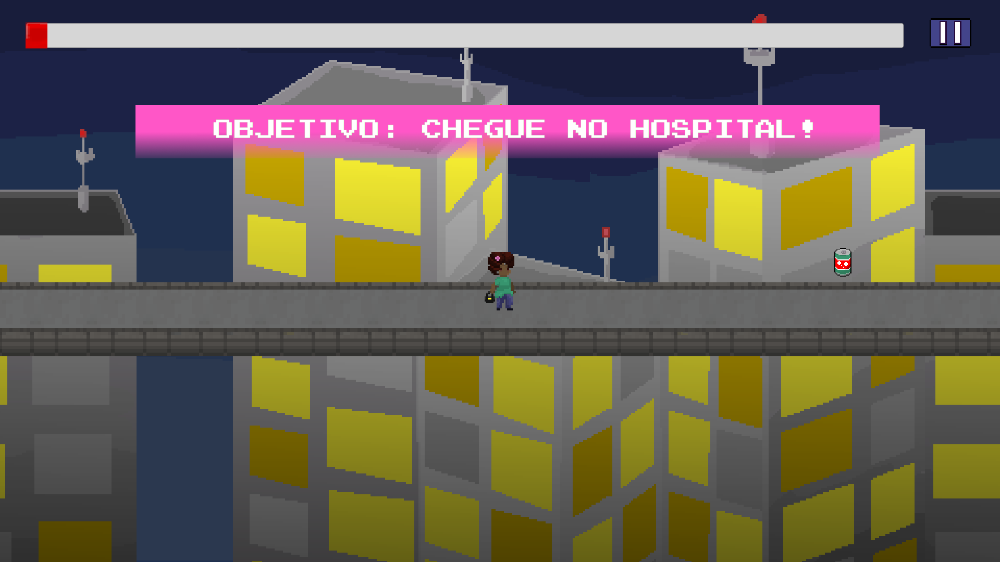
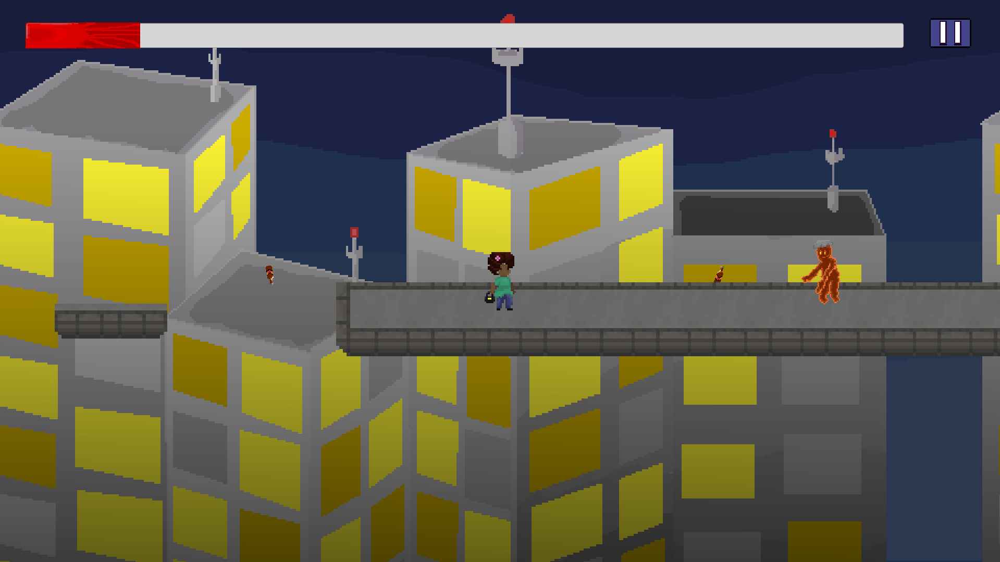
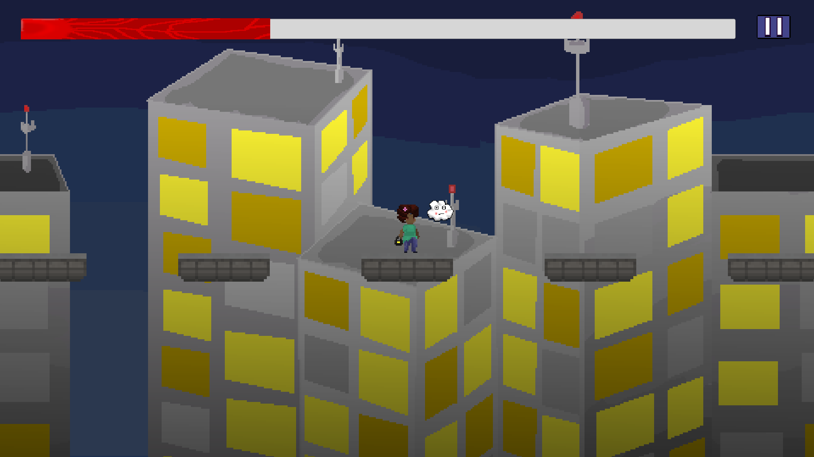
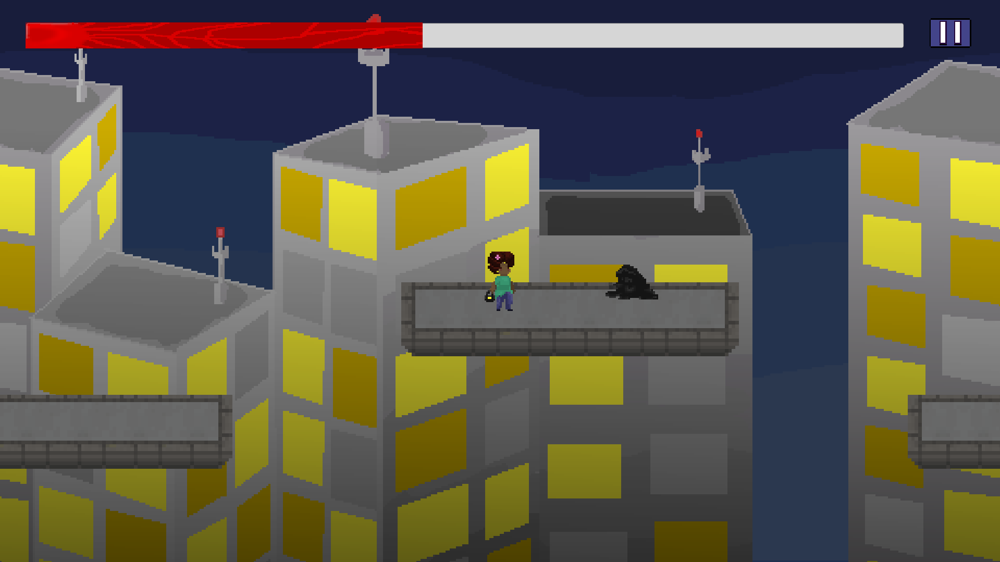

# Surpresa Rosa

Um jogo desenvolvido por mim que tem como tema a conscientização sobre o autoexame de mama. O jogo foi criado com o objetivo de aumentar a conscientização sobre este assunto importante e encorajar as pessoas a serem mais conscientes de sua saúde. Durante o jogo, os jogadores aprendem como realizar o autoexame de mama corretamente, bem como obter informações valiosas sobre o câncer de mama.

## Objetivo do desenvolvimento do jogo

Este jogo foi desenvolvido com o intuito de ser submetido a avaliação final de semestre, do curso de Jogos Digitais no IFBA - Lauro de Freitas. Tendo como norteamento o tema transversal o Outubro Rosa, com o enfoque no **AutoExame das Mamas**.

## Imagens do jogo

- **Menu inicial**
  

- **Gameplay**
  - Após a cutscene que introduziu a lore do jogo, o jogador precisa cumprir seu objetivo.
  

- **Bebum**
  - Um dos inimigos e também vícios da personagem, materializados na mente dela.

- **Fantasma**
  - O fantasma, ou melhor, a ansiedade sentida pela personagem a persegue aumentando o progresso do câncer.

- **A Depressão**
  - A depressão materializada ira patrulhar as plataformas com o objetivo de aumentar o progresso do câncer.

## Tecnologias utilizadas

- **Unity (Game Engine)**
- **Aseprite (Software de Pixel Art)**